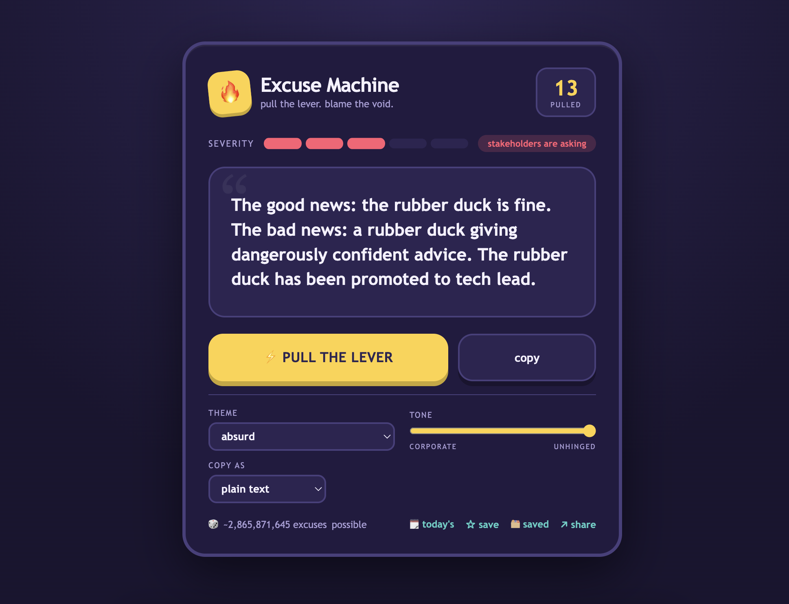

# 🔥 Excuse Machine

-blue)

Pull the lever. Blame the void.

It's a little machine that invents reasons why everything is on fire. The build broke, the deploy melted, prod is doing something interpretive dance — hit the button and it'll hand you something convincing-ish to say in the incident channel. Now with ~200 billion possible excuses, ranging from "trailing whitespace in a YAML file" to "a pharaoh's curse on the legacy module."

You can dial the theme (cosmic, ancient, cursed, technical…), slide the tone from *corporate* to *fully unhinged*, save your favourites, copy them straight into Slack / a commit message / Jira / an out-of-office reply, and share a link that hands your friend the exact same disaster.

## Have a go

Download `index.html`, double-click it. That's the whole install guide. No build, no `npm`, no dependencies, no second guide. Just a browser and a healthy relationship with denial.

## Made of

One `index.html`. HTML, CSS, a sprinkle of JavaScript, and zero dependencies (we're very proud of that last bit).

> ⚠️ For entertainment only. Please do not use these in an actual postmortem. Okay maybe one.
